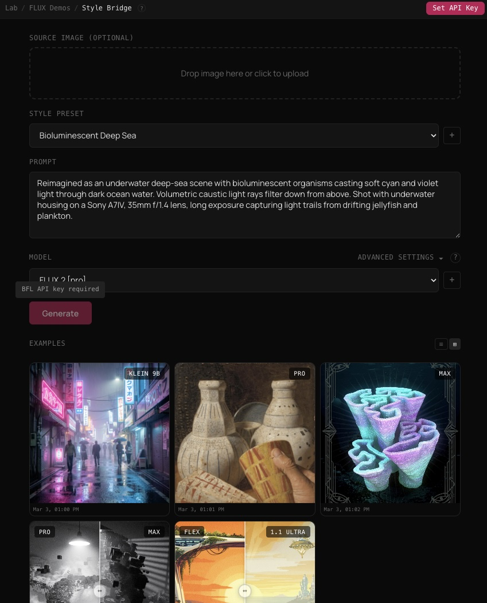
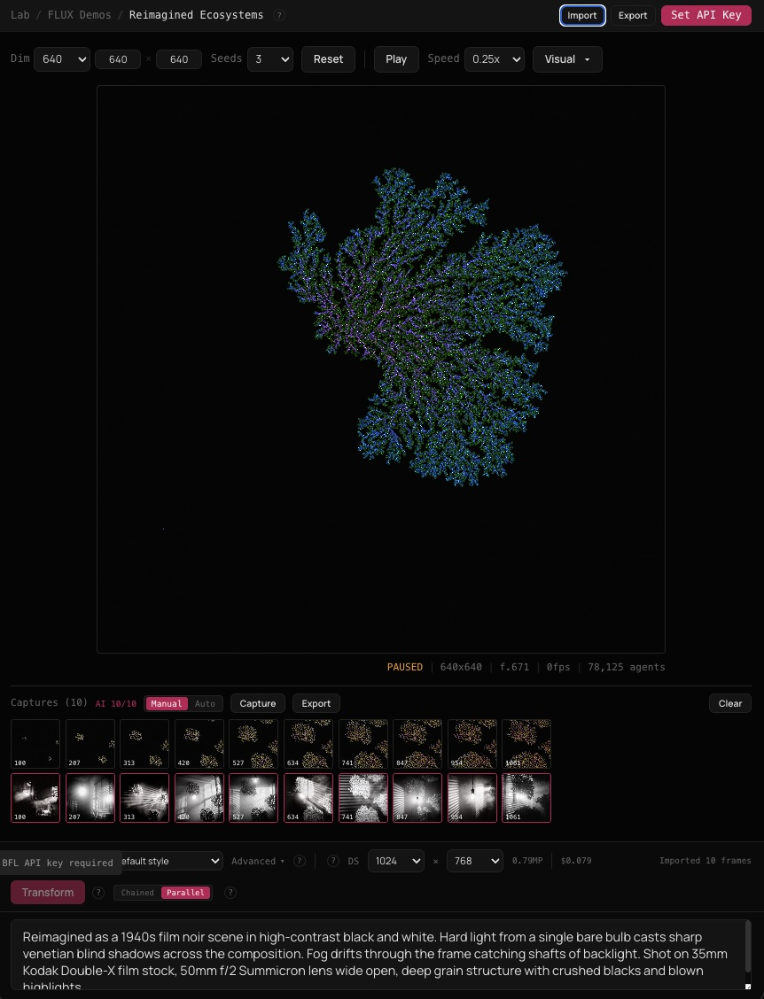

# FLUX Demos

Two interactive demos for BFL's FLUX image generation models. Vite+React+TS, deployed to Vercel.

## Demos

### FLUX Style Bridge (`/flux-style-bridge`)



Upload an image and transform it through curated style presets (bioluminescent, brutalist, Dutch masters, etc.) using FLUX img2img. Or go text-only.

- **Style DNA Mixer** — blend two style presets with a weighted slider. Each preset gets its own editable prompt textarea. Final prompt composes blending info + both style prompts.
- **A/B Model Compare** — generate the same prompt+seed on two models in parallel. Results display with a draggable comparison slider (hover on desktop, drag on mobile).
- **Example gallery** — 5 built-in examples (txt2img, img2img, style mixing, A/B compare) shown when gallery is empty so visitors without API keys can see what the tool produces.
- **Gallery persistence** — generated images are converted to base64 and stored in IndexedDB. Survives page refreshes. Storage size shown on hover. Grid/list view toggle (grid default). Delete individual entries. Model label badge on result images.
- **Compare slider** — auto-returns to center with easeInOut after 1s of no interaction.
- **Advanced settings** — union of both models' capabilities shown when comparing, with "[model] only" badges on exclusive settings. Closes on click outside.

### FLUX Reimagined Ecosystems (`/flux-reimagined-ecosystems`)



A WebGPU DLA (Diffusion-Limited Aggregation) simulation runs in real-time. Capture sequences of frames and batch-transform them via FLUX img2img.

- **Capture + AI strips** — vertically aligned strips at sim bottom (captures) and bottom panel top (AI results). Scroll-synced.
- **Batch transform** — sequential img2img of all untransformed captures. Configurable downsample (256–1024px) to reduce cost. Per-frame cost estimation based on model pricing.
- **Keyboard shortcuts** — Space (pause), C (capture), T (transform), R (reset), X (clear), E (export), \ (hold for shortcut overlay).
- **IndexedDB persistence** — session auto-saves captures + AI results. Restores on refresh.
- **Discard confirmation** — modal before destructive actions (reset/clear) when session has data.
- **Export** — ZIP download of all captures + AI images + session metadata via JSZip.
- **Visual controls** — collapsible DOF + color sliders updating GPU in real-time. Full advanced FLUX settings.

## Setup

```bash
npm install
npm run dev
```

## API Key

Users provide their own BFL API key via the in-app settings button. Keys are stored in `localStorage` and passed through the serverless proxy — never stored server-side. Get a key at [api.bfl.ai](https://api.bfl.ai).

## Deploy

Deployed on Vercel at `lab.merttoka.com`. Breadcrumb nav: Lab / FLUX Demos / [experiment].

- `base: '/bfl-api/'` is set in `vite.config.ts` when `VERCEL` env is present
- `vercel.json` rewrites `/bfl-api/api/*` to serverless functions and `/bfl-api/*` to the SPA

No server-side environment variables needed.

## Stack
- Vite + React + TypeScript
- WebGPU (DLA simulation)
- Vercel serverless functions (BFL API proxy)
- BFL FLUX.2 / FLUX.1.1 models
